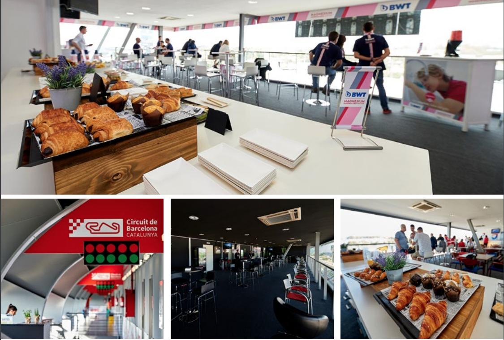
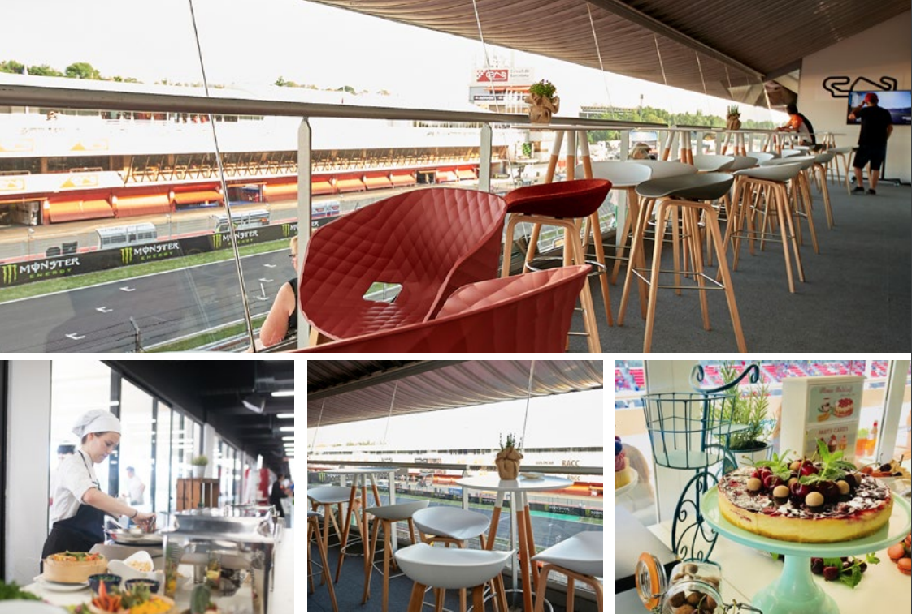
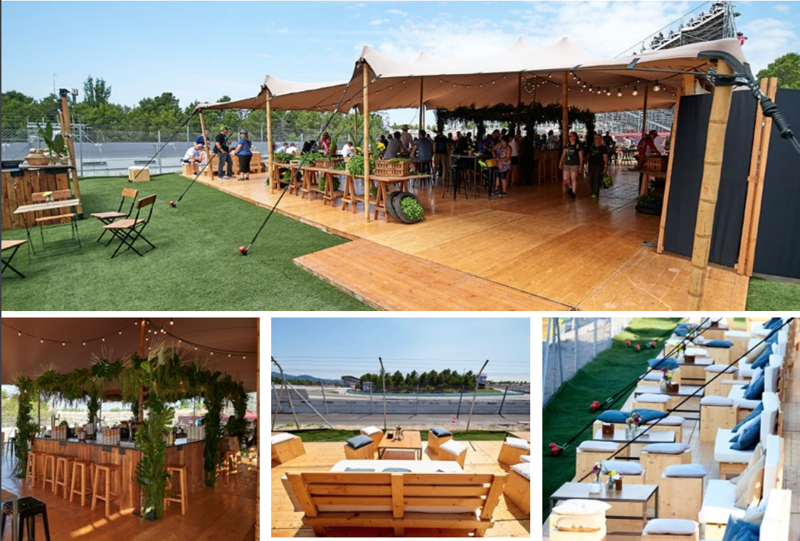

<script> 
    $(document).ready(function() { 
    $head = $('#header'); 
    $head.prepend('<A href = https://www.cuttingedge-events.com></A>') 
    }); 
</script> 


```{r echo=FALSE, message=FALSE,warning=FALSE}
library(readxl)
library(shiny)
library(dplyr)
```

## Accommodation

### **Main Hotel: Ohla Barcelona**

**Ohla Barcelona** features rooms with contemporary decor and large windows. They all include a flat-screen TV, free WiFi and an iPod dock. The modern bathrooms come with bathrobes and slippers. Some rooms have views over the historic Gothic Quarter.
Romain Fornell is currently the head chef for all the culinary spaces at hotel Ohla Barcelona: Caelis restaurant, Vistro49, and La Plassohla. This last restaurant is specialised in catalan cuisine, offers tapas and small dishes. Guests can have a cocktail in the famous Ohla Boutique Bar.

The rooftop swimming pool offers fantastic city views with a chill out terrace. Other facilities at this hotel include a gym and a wellness area with a sauna.

The **Ohla Barcelona** is 300 m from Plaza Catalunya Square while Urquinaona Metro Station is only 200 m away. Passeig de Gracia Avenue and Gaudi's modernist buildings are 10 minutes' walk of the hotel. 

  


### **Alternative Hotels** {.tabset .tabset-fade .tabset-pills}

#### OD Barcelona

OD Barcelona features air-conditioned rooms with satellite flat-screen TV in the Eixample district of Barcelona. Boasting a 24-hour front desk, this hotel also provides guests with a seasonal outdoor pool. Guests can enjoy a selection of international cuisine in the in-house restaurant.

At the hotel, each room is fitted with a desk. Featuring a private bathroom, rooms at OD Barcelona also offer free WiFi. All guest rooms include a wardrobe.

Buffet and à la carte breakfast options are available every morning at the hotel.

Guests will have free access to Urquinaona Holmes Place Gym, 800 m from the hotel. 

 

 

#### Le Meridien

Frequently hosting world-famous celebrities, this prestigious hotel is located on Barcelona's famous Las Ramblas. Le Meridien's stylish rooms feature flat-screen TVs, a music system and iPod dock.

The iconic building housing Le Meridien Barcelona features a Neoclassical style facade and chic, boutique design throughout with bright colours. Some rooms have carpets featuring a Barcelona street map design, while others have Gaudi-inspired finishings.
The Meridien serves a varied, international breakfast. The CentOnze restaurant provides creative Mediterranean cuisine and cocktails, prepared with fresh ingredients from the nearby Boqueria Market, as well as music and impressive views of Las Ramblas.

 


#### H10 Metropolitan

Featuring a rooftop terrace with a bar and chill-out pool, **H10 Metropolitan** is located in Barcelona, 90 m from Plaza Catalunya. It offers a tapas restaurant and free WiFi.

Each room has a flat-screen satellite TV, air conditioning, coffee machine and a minibar. The private bathroom comes with a hairdryer and bathrobes.

The **H10 Metropolitan** is located just 2 minutes' walk from Paseo de Gracia Avenue, with its boutique and designer fashion stores. The hotel is 700 m from Gaudi's La Pedrera, and you can walk to Las Ramblas in 3 minutes. 


 

 

#### 1898 Hotel

Situated on Barcelona's famous La Rambla, this restored 19th-century building features a rooftop pool with a sun terrace. The elegant rooms include free Wi-Fi and a marble bathroom.
The colonial-style **Hotel 1898** has unique architectural and historical heritage which gives it the Speciality Monument status.

It features a stylish restaurant serving Mediterranean cuisine. It also offers a bar-restaurant with a terrace where guests can enjoy traditional tapas.
Plaza Catalunya is just 200 m from 1898 Hotel. Guests can also walk to the Gothic Quarter with its cathedral in 10 minutes. 


 


 


## Programme

### **Programme Overview and timeline**

```{r echo=FALSE, message=FALSE,warning=FALSE}
library(timevis)
library(dplyr)
library(readxl)

timeline <- read_excel("timeline.xlsx", sheet = "Sheet1", 
    col_types = c("date", 
        "text", "text", "numeric", "text", 
        "text"))

data <- data.frame( id = 1:length(timeline$start),
                    start = as.POSIXlt(timeline$start),
                    content = timeline$content,
                    group = timeline$group,
                    type = "box",
                    style = "background-color:#FF9933;")

groups = data.frame(id = 1:4, content = c("Morning", "Lunch", "Afternoon", "Diner"))

tl <- timevis(data, groups, showZoom = TRUE, zoomFactor = 0.2, fit = TRUE, width = '100%', height = 300)

tl %>% setOptions(list(orientation = "top", align = "left"))

```

### **Map**

```{r echo=FALSE, warning=FALSE, message=FALSE}

library(leaflet)
library(stringr)
library(ggmap)
library(readxl)
library(dplyr)
library(leaflet.extras)
library(shiny)

coordinates <- read_excel("timeline.xlsx", 
    sheet = "Sheet3", col_types = c("text", 
        "text", "numeric", "numeric", "text", 
        "text"))

coordinates$Category <- factor(coordinates$Category)

m <- coordinates %>% 
  leaflet(options = leafletOptions(dragging = TRUE,
  minZoom = 14, maxZoom = 18)) %>% 
  addProviderTiles("Esri") %>% 
  setView(lng = 2.1687300, lat = 41.3863900, zoom = 14) 

pal <- colorFactor(palette = c("red","blue"),
      levels = coordinates$Category)

m %>% clearBounds() %>% 
  addCircleMarkers(radius = 5, color = ~pal(Category)) %>% 
  addPopups(popup = paste0("<b>",coordinates$Location,"</b>")) %>% 
  addLegend(position = "bottomright", pal = pal, 
  values = coordinates$Category) %>% addResetMapButton()

```

### **DAY 1: Friday, May 10th** {.tabset .tabset-fade .tabset-pills}

Guests will arrive in Barcelona Airport where one person from Cutting Edge Events will wait them and assist during the transfer to the hotel and check-in.

After having some time to refresh, guests will be transfered by bus to the restaurant for dinner. The options that we suggest for the first night are both elegant restaurants that offer very good food and service.

#### Restaurant L'Olive 

L'Olive cuisine is a perfect sample of the Catalan and Mediterranean gastronomic tradition, with mountain and sea specialities, always prepared with an original, modern touch and the best quality. Desserts are home-made and the wine list features important references.

With a perfectly trained staff, the restaurant -that boasts three wonderful private rooms- is the perfect scenario this welcome dinner.

 

#### Restaurant Windsor

Located in a beautiful Catalan Modernist building for two decades, Windsor provides the most special setting to enjoy the updated Catalan haute cuisine by young chef Carlos Alconchel, who works with selected seasonal products of proximity. 
The space -elegant, contemporary and flooded with natural light- has a great terrace and different private dining rooms.

 


### **DAY 2: Saturday, May 11th** 

9.00h After enjoying a very good breakfast at the hotel, guests will be transferred to Circuit de Catalunya in Montmel?? to enjoy the F1 experience. 


#### The Circuit de catalunya offers different options {.tabset .tabset-fade .tabset-pills}

##### SuperFan tickets

Valid for 3 days, these tickets are valid for the Tribunes A, L, B and E

 


##### Excellence tickets

Valid for 3 days, these tickets are valid for the Tribunes I, H, G and F

 


##### Suite Platinum

Suite Platinum is a room up to 25 pax, with perfect views to the Pit Lane and Boxes. The rental of the Suite Platinum is valid for Saturday and Sunday and it includes seats at the Main Tribune, 2 staff passes, Pit Lane Tour, TV screen to follow the race, catering service, customized badges and furniture.

 


##### Pedralbes Club

Being part of the Pedralbes Club, guests will be Gold Members. They  can access to the Suite located at the Main Tribune, the most emblematic of the Circuit and an entrance ticket. From here guests will see the Pit Lane and the Podium perfectly.  

Guests will enjoy a Pit Lane Tour and catering service from 9.00h to 16.00h

 


##### Village GP

This is a Silver Club, being member of this club they will have an entrance ticket for the Tribune I and they will enjoy catering service from 9.00h to 16.00h.
It is a relaxed area with very good views.

 

#### .
16.00h Guests will go back to the hotel and  will have some free time to refresh before dinner.
20.15h Bus transfer for dinner, the bus will be at disposal during dinner.
For this dinner we would suggest two options, the first one is an exclusive tapas restaurant and the second one is a restaurant specialiced in wines. Both of course offer high quality service.

#### Restaurant options {.tabset .tabset-fade .tabset-pills}

##### Boca Grande

With a stunning design signed by the trendiest designer Lazaro Rosa-Viola, the space welcomes us with an attractive decorative eclecticism that is both original and striking. The sober and elegant New York style decor is indeed the main attraction of each and every single space in Boca Grande.
The restaurant, the kitchen of which is led by Xavier Tranque (The Mirror, Ovic) and based on seafood to offer a quality menu, is on the ground floor and dominated by bar where oysters, lobsters, prawns... are displayed. It also has a great terrace in the patio of the building.

The second floor is a fabulous cocktail bar with an oriental touch that will definitely witness great nights, while the top floor houses a nice private room with terrace. Interestingly enough, the bathrooms are located in the basement and share the space with the resident DJ's booth and dim lighting that creates the perfect atmosphere for intimate encounters.

 

##### Monvinic

Monvinic is a pioneering space dedicated to wine culture dissemination. It boasts a library, a wine bar, a cellar with more than 3.000 labels from all around the world, a room for wine tasting and conferences and a gastronomic space where we will enjoy Sergi Mei?????s cuisine. All the above, in a really breathtaking setting.

 


### **DAY 3: Sunday, May 12th** 

Guests will return to the Circuit de Catalunya to enjoy the F1 Race, they will depart from the hotel at 9.00h and they will return at 16.00h, so, they will be at the hotel at 17.00h (approximately)

After some free time to refresh and relax, at 20.00h they will go by bus to the restaurant to have dinner.
For the last night we suggest a restaurant located near the sea. The first option: Torre d'Alta Mar is located in a tower and it offers stunnig 360 views. The second option: Pez Vela is a very good restaurant specialized in rice dishes, located at the beach with great city views.

#### Restaurant options {.tabset .tabset-fade .tabset-pills}

##### Torre d'Alta Mar

Located on one of the towers of the cable car that goes from La Barceloneta to Montjuic, 75 meters high, Torre d'Alta Mar presents an idyllic scenerio for the most special evenings.

With an exquisite contemporary interior design, the luxurious restaurant served up its best dish in the shape of spectacular views over the Mediterranean sea and the city of Barcelona. The experience begins in a glass lift that won't let us miss any details of the privileged place where are in. Once in the restaurant, the setting is simply astonishing, especially at night, and more than well worth a visit to the restaurant.

The menu offers the best of the Mediterraean gastronomy, with top quality products and the chef's personal touch.

 


##### Pez Vela

The style and design define the environment in which this new referent welcomes us in the area, an exquisite space designed by Sandra Tarruella. In a fresh, modern and informal atmosphere, beach and Mediterranean elements combine with industrial aesthetics, plenty of natural light and unique views. The terrace is simply a luxury, ideal also for a summer drink after dinner.

The menu of Pez Vela is centered on salads and rice dishes, but also includes a good selection of wild fish and charcoal grilled meats. The dishes are made with fresh products of the highest quality that retain all the natural flavor.

 

### **DAY 4: Monday, May 13th** 

Guests will enjoy a free morning to go for a walk or do some shopping.

At 12.00h guests will meet at El Nacional for eating some tapas before their departure.
**El National** is a new culinary concept: an emblematic restaurant with different spaces to enjoy traditional dishes of the peninsula made with excellent ingredients.

We suggest La Taperia, where they will enjoy a modern tapas menu based on the most traditional dishes elaborated with fresh, seasonal products.

Restaurant built in a modernist space dating from 1889, with Catalan ceilings and skylights that give way to the light illuminating the huge room. Interior designed by Lazaro Rosa-Violan, inspired by the 30s and 40. With four specialized bars. With a singular charm, it is an extraordinary architectural work.


Once they will finish they will go walking to the hotel (just 10 minutes away) to pickup their luggage. They will be transferred to the airport.

END OF THE PROGRAMME


## Budget

```{r echo=FALSE, message=FALSE,warning=FALSE}

library(readxl)
library(dplyr)
library(knitr)
library(kableExtra)
library(DT)

budget <- read_excel("timeline.xlsx", sheet = "Sheet2", 
    col_types = c("date", "text", "text", 
        "numeric", "text", "numeric", "numeric"))
budget$DATE <- as.Date(budget$DATE)

DT::datatable(budget, extensions = "Buttons",rownames = FALSE, options = list(paging= FALSE,
initComplete = JS("
    function(settings, json) {
      $(this.api().table().header()).css({
        'background-color': '#ee7600 ',
        'color': '#fff'
      });
    }"),
dom ='Bfrtip', buttons = c('copy','print'),                           pageLength = nrow(budget),autoWidth = TRUE)) %>% 
   formatDate('DATE') %>% 
  formatCurrency(6:7,'\U20AC')


```

### Terms & Conditions

  *Rates valid for 2019.
  
  *Net rates for Planet Escape
  
  *For a group of minimum 15 pax and 15 rooms, It is including Free accommodation, transfers and meals for 1 tourleader (not the F1 entrance tickets or any other activity)
  
  *Cutting Edge Events management fee including in the detailed rates
  
  *VAT included. 
  
  *No reservation has been done. Availability upon request.

## Company Profile


